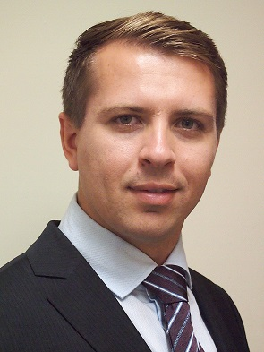

::: {.profile}
{.profile-photo}

::: {.profile-text}
I am an Associate Professor at Bocconi University, where I direct the
[Dondena AI and Society Initiative (DAISI)](https://dondena.unibocconi.eu/research-areas/welfare-state-and-taxation-unit/dondena-ai-and-society-initiative-daisi)
and serve as Academic Director of the BSc in
[International Politics and Government](https://www.unibocconi.it/en/programs/bachelor-science/international-politics-and-government)
and of the Bocconi–HEC double-degree in
[Data, Society and Organizations](https://www.unibocconi.it/en/programs/bachelor-science/international-politics-and-government/hec-bocconi-double-degree).

My research asks how technological change reshapes labor markets, families, and
politics — and what that means for the people on the receiving end of it. I work
on automation and artificial intelligence, migration, education, and the
political consequences of economic shocks.

I am a Research Fellow at [CESifo](https://www.cesifo.org/en),
[IZA](http://www.iza.org/profile?key=21610), the
[ROCKWOOL Foundation Berlin](https://www.rfberlin.com/),
[IGIER](https://igier.unibocconi.eu/), and the
[Dondena Centre](https://dondena.unibocconi.eu/).
:::
:::

## New & Forthcoming



[See all research →](research.qmd){.more-link}
